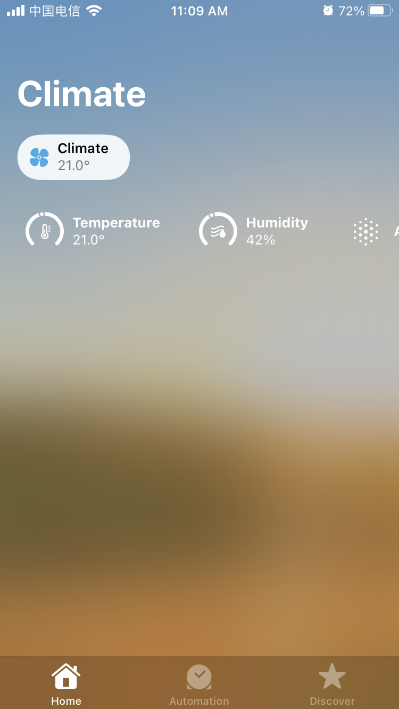
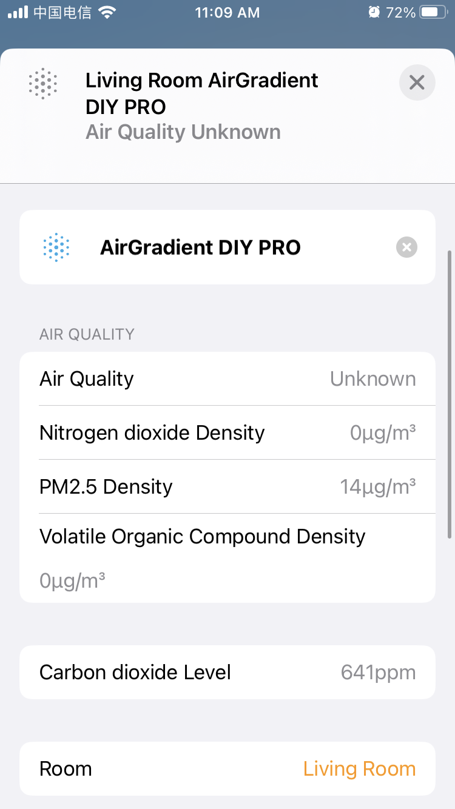
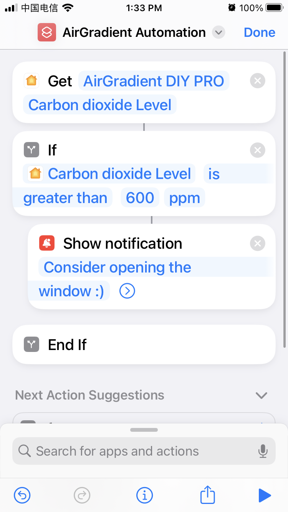

# airgradient-homekit

Experimental Apple HomeKit-compatible firmware for [airgradienthq/arduino](https://github.com/airgradienthq/arduino), based on [Mixiaoxiao/Arduino-HomeKit-ESP8266](https://github.com/Mixiaoxiao/Arduino-HomeKit-ESP8266/).

## Usage

* Make sure you're using ESP8266 Core 3.0.2 or lower because of [an issue](https://github.com/esp8266/Arduino/issues/8830) with versions 3.1.0 and 3.1.1
* Load the DIY_PRO_V3_7 example
* Set the CPU Frequency (in "Tools") to 160 MHz.
* Upload
* In the "Home" app, add an accessory, click "More options...".
* The "AirGradient DIY PRO" should show up in the list of nearby devices.
* Pair with code 1111-1111 (this can be changed in `homekit.c`).

## Unpairing

* After the initial pairing with a phone, cryptographic keys are stored in the device's EEPROM. To remove them again, either flash the firmware again with "Erase Flash" set to "All Flash Contents", or select the "Clear HomeKit Pairing" option in the Config Menu and press the button for four seconds.

## Screenshots

